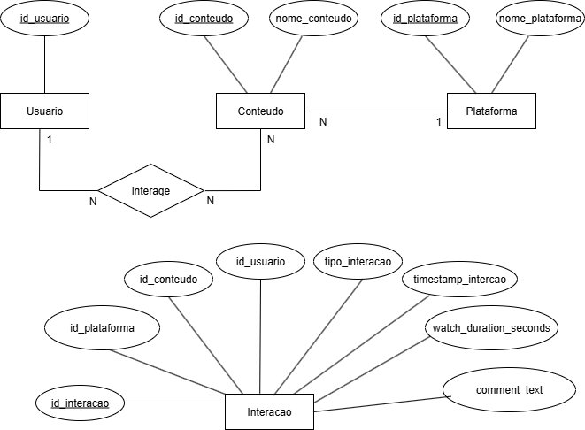
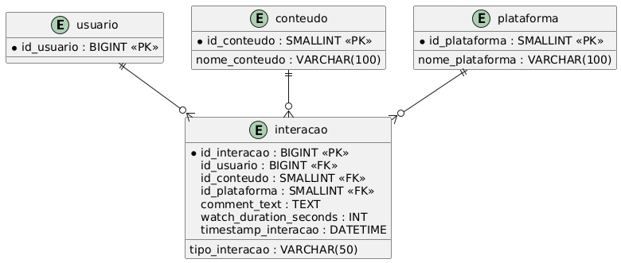

# 📊 Projeto Unificado - Fase 4: Persistência e Análise de Engajamento com Banco de Dados Relacional

## 📌 Objetivo

Esta fase do projeto tem como foco principal a aplicação dos conceitos de **Banco de Dados Relacional** em um sistema de análise de engajamento de mídias. Após trabalhar com dados em memória nas fases anteriores, agora a proposta é persistir as informações em um banco de dados MySQL, promovendo maior **robustez**, **escalabilidade** e **aderência às práticas de mercado**.

Módulo Foco: Banco de Dados

---
### 1. Contexto

Nas fases anteriores, o sistema manipulava dados de engajamento diretamente a partir de arquivos CSV, utilizando estruturas como listas e dicionários em Python. Apesar de funcional, essa abordagem não fornecia persistência dos dados nem suportava grandes volumes.

Nesta fase, implementamos:

- **Modelagem relacional** das entidades
- **Criação de esquema SQL** (DDL)
- **Inserção de dados** (DML)
- **Consultas para análise** (DQL)

---

### 2. Banco de Dados

#### 🗂️ Entidades Modeladas

- **Usuário**
- **Conteúdo**
- **Plataforma**
- **Interação**

#### 🧩 Modelagem

- **Modelo Entidade-Relacionamento (MER)**
  
  

- **Modelo Lógico (DER)** com definição de:
  - Tipos de dados
  - Chaves primárias (PK)
  - Chaves estrangeiras (FK)
  - Restrições: `NOT NULL`, `UNIQUE`

  


#### 📄 Script DDL

- Arquivo: `schema.sql`
- Banco: `globo_tech`
- Tabelas criadas com `CREATE TABLE`
- Restrições de integridade referencial definidas via `FOREIGN KEY`

---

### 3. Carga de Dados (DML)

- Inserção dos dados reais extraídos do CSV
- Comandos utilizados: `INSERT INTO`
- Scripts organizados por entidade para melhor leitura e manutenção

---

### 4. Consultas SQL (DQL)

Consultas criadas para análise dos dados persistidos:

- 🔝 **Ranking de conteúdos mais consumidos** (ordenados por tempo total de consumo)
- 🚀 **Plataforma com maior engajamento** (total de interações like, share, comment)
- 💬 **Conteúdos mais comentados**

---

## 📂 Estrutura do Projeto

```
projeto_engajamento_fase_4/
│
├── __init__.py
|
├──img/
|    |
|    ├── modelo_entidade_relacionamento.png
|    |
|    └── diagrama_entidade_relacionamento.png
|
├── interacoes_globo.csv           # Dados brutos de interações
|
├── main.py                        # Ponto de entrada da aplicação
|
├── schema.sql                     # Script para execução de sql (criação, inserção e análise do banco)
|
├── sistema.py                     # Código python para criação, inserção e análise do banco
|
└── README.md
```

## 🧪 Avaliação

| Critério                                                     | Peso |
|--------------------------------------------------------------|------|
| Qualidade da Modelagem de Dados (MER, DER, Normalização)     | 4.0  |
| Correção e Completude do Script DDL (`schema.sql`)           | 2.0  |
| Carga de Dados (`insert_data.sql`)                           | 2.0  |
| Corretude das Consultas SQL (`queries.sql`)                  | 3.0  |
| Clareza, Organização e Documentação do Código                | 1.0  |

---

## 🛠️ Tecnologias Utilizadas

- **Python 3.10+**
- **MySQL 8+**
- **MySQL Workbench** (modelagem e execução)
- **SQL (DDL, DML, DQL)**
- **Diagramas com Draw.io**

---

## 🚀 Como Executar

1. Clone o repositório:

   ```bash
   git clone https://github.com/seu-usuario/projeto_engajamento_fase_.git
   cd projeto_engajamento_fase_3
   ```

2. Certifique-se de que o Python 3 está instalado:

   ```bash
   python3 --version
   ```

3. Certifique-se de que a biblioteca mysql-connection está instalada, para instalar execute:

   ```bash
   pip install mysql-connector-python
   ```

4. Crie um arquivo chamado env_vars.py no formato seguinte com os dodos do sua conexão mysql local:
   ```bash
    host = "localhost"
    user = "seu_usuario ex:root"
    password = "sua_senha_se_houver" 
    database= ""
   ```

5. Execute o projeto:
   ```bash
   python main.py
   ```

---


## Equipe de colaboradores

|  |  |  |  |
| :-----------------------------------------------------------------------------------------------------------------------------------: |  :--------------------------------------------------------------------------------------------------------------------------------: | :----------------------------------------------------------------------------------------------------------------------------: | :--------------------------------------------------------------------------------------------------------------------------------: |
|                            <a href="https://github.com/EdOliveiraJr" target="_blank"> Edvaldo Oliveira</a>                            |                            <a href="https://github.com/malufazenda" target="_blank"> Malu Fazenda</a>                            |                           <a href="https://github.com/danilodpx" target="_blank"> Danilo Pinho </a>                            |                           <a href="https://github.com/LucasSandes07" target="_blank"> Lucas Sandes </a>                            |

---

## 📝 Licença

Este projeto é apenas para fins educacionais.
